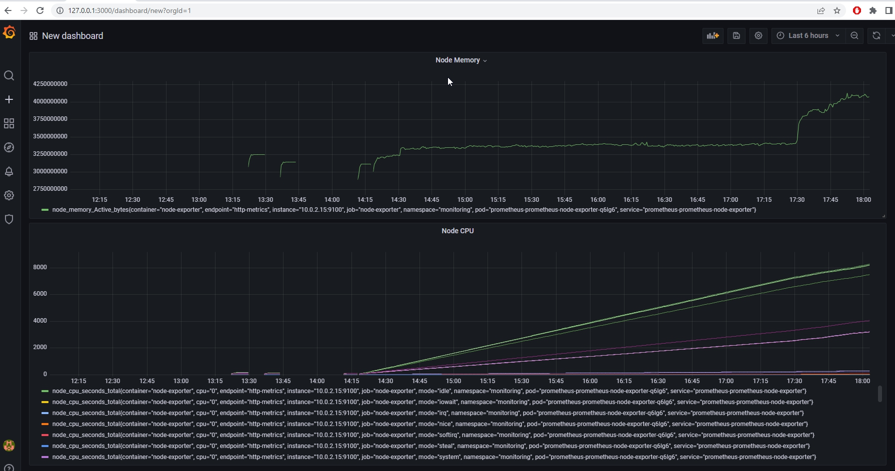
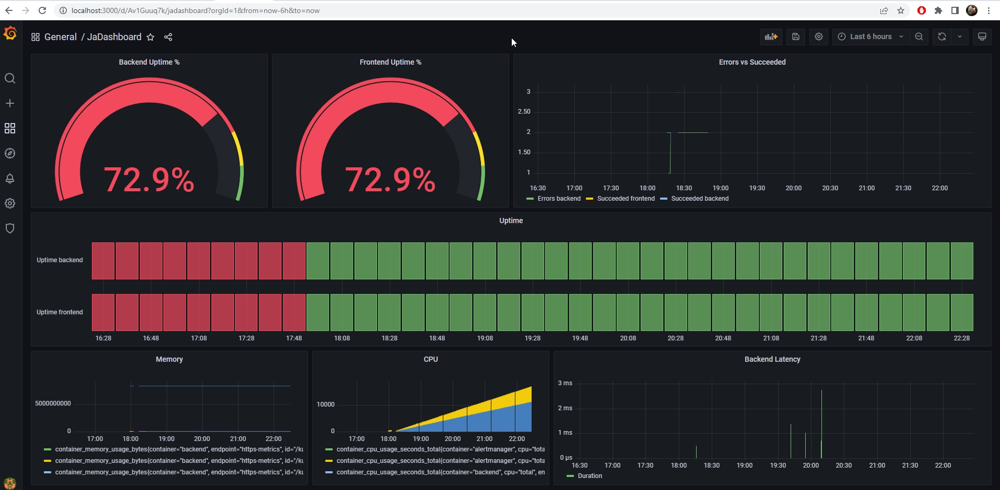

**Note:** For the screenshots, you can store all of your answer images in the `answer-img` directory.

## Verify the monitoring installation

*TODO:* run `kubectl` command to show the running pods and services for all components. Take a screenshot of the output and include it here to verify the installation


```
localhost:/home/vagrant # kubectl get pod,service
NAME                               READY   STATUS    RESTARTS   AGE
pod/svclb-trial-service-zskd7      1/1     Running   3          15h
pod/svclb-backend-service-9kd4s    1/1     Running   3          15h
pod/svclb-frontend-service-zmckt   1/1     Running   3          15h
pod/frontend-app-6f8cc6dbd-w6t6r   1/1     Running   0          21m
pod/backend-app-68b6688b85-4wnnl   1/1     Running   0          21m
pod/trial-app-576f987ff6-q5rrr     1/1     Running   0          21m
pod/backend-app-68b6688b85-r79gq   1/1     Running   0          19m
pod/frontend-app-6f8cc6dbd-vmzs9   1/1     Running   0          19m
pod/trial-app-576f987ff6-685rc     1/1     Running   0          19m
pod/backend-app-68b6688b85-6qfwf   1/1     Running   0          18m
pod/frontend-app-6f8cc6dbd-mrgqf   1/1     Running   0          18m
pod/trial-app-576f987ff6-zl4lt     1/1     Running   0          18m
 
NAME                       TYPE           CLUSTER-IP      EXTERNAL-IP   PORT(S)          AGE
service/kubernetes         ClusterIP      10.43.0.1       <none>        443/TCP          21h
service/trial-service      LoadBalancer   10.43.133.107   10.0.2.15     8082:30862/TCP   15h
service/backend-service    LoadBalancer   10.43.94.249    10.0.2.15     8081:30818/TCP   15h
service/frontend-service   LoadBalancer   10.43.118.240   10.0.2.15     8080:31191/TCP   15h
 
localhost:/home/vagrant # kubectl get pod,service -n monitoring
NAME                                                         READY   STATUS    RESTARTS   AGE
pod/prometheus-kube-prometheus-operator-596549d76d-qvvt6     1/1     Running   4          21h
pod/prometheus-kube-state-metrics-847b7f5749-l84zw           1/1     Running   5          21h
pod/alertmanager-prometheus-kube-prometheus-alertmanager-0   2/2     Running   8          21h
pod/prometheus-prometheus-kube-prometheus-prometheus-0       2/2     Running   8          21h
pod/prometheus-grafana-f79599765-s9thn                       3/3     Running   12         21h
pod/prometheus-prometheus-node-exporter-q6lg6                1/1     Running   4          21h
 
NAME                                              TYPE        CLUSTER-IP      EXTERNAL-IP   PORT(S)                      AGE
service/prometheus-kube-prometheus-prometheus     ClusterIP   10.43.99.147    <none>        9090/TCP                     21h
service/prometheus-kube-prometheus-alertmanager   ClusterIP   10.43.255.115   <none>        9093/TCP                     21h
service/prometheus-prometheus-node-exporter       ClusterIP   10.43.44.17     <none>        9100/TCP                     21h
service/prometheus-kube-state-metrics             ClusterIP   10.43.153.152   <none>        8080/TCP                     21h
service/prometheus-grafana                        ClusterIP   10.43.91.255    <none>        80/TCP                       21h
service/prometheus-kube-prometheus-operator       ClusterIP   10.43.31.241    <none>        443/TCP                      21h
service/alertmanager-operated                     ClusterIP   None            <none>        9093/TCP,9094/TCP,9094/UDP   21h
service/prometheus-operated                       ClusterIP   None            <none>        9090/TCP                     21h
 
kubectl get pod,service -n observability
NAME                                   READY   STATUS    RESTARTS   AGE
pod/jaeger-operator-764c7d7d74-kj4q2   2/2     Running   10         15h
 
NAME                                      TYPE        CLUSTER-IP      EXTERNAL-IP   PORT(S)    AGE
service/jaeger-operator-metrics           ClusterIP   10.43.150.231   <none>        8443/TCP   20h
service/jaeger-operator-webhook-service   ClusterIP   10.43.242.200   <none>        443/TCP    20h
```
## Setup the Jaeger and Prometheus source
*TODO:* Expose Grafana to the internet and then setup Prometheus as a data source. Provide a screenshot of the home page after logging into Grafana.


 
## Create a Basic Dashboard
*TODO:* Create a dashboard in Grafana that shows Prometheus as a source. Take a screenshot and include it here.


 
## Describe SLO/SLI
*TODO:* Describe, in your own words, what the SLIs are, based on an SLO of *monthly uptime* and *request response time*.

SLI are concrete strategies used to measure the achievement of an SLO, in the case of "monthly uptime" SLO will be
the measure of the uptime through months (99%, 98% of uptime in the month).  In the case of
"requests response time", will be the average time in milliseconds or seconds that the requests take to be reponse (100ms, 50ms, 500ms)
and the average failed requests (no response) in the period time (ratio).
 
 
## Creating SLI metrics.
*TODO:* It is important to know why we want to measure certain metrics for our customer. Describe in detail 5 metrics to measure these SLIs. 

+ uptime
+ failed requests count by month
+ total requests count by month
+ Latency: avg requests time by month
+ (succeeded / total) requests by month ratio
 
 
## Create a Dashboard to measure our SLIs
*TODO:* Create a dashboard to measure the uptime of the frontend and backend services We will also want to measure to measure 40x and 50x errors. Create a dashboard that show these values over a 24 hour period and take a screenshot.


 
## Tracing our Flask App
*TODO:*  We will create a Jaeger span to measure the processes on the backend. Once you fill in the span, provide a screenshot of it here. Also provide a (screenshot) sample Python file containing a trace and span code used to perform Jaeger traces on the backend service.


 
## Jaeger in Dashboards
*TODO:* Now that the trace is running, let's add the metric to our current Grafana dashboard. Once this is completed, provide a screenshot of it here.


 
## Report Error
*TODO:* Using the template below, write a trouble ticket for the developers, to explain the errors that you are seeing (400, 500, latency) and to let them know the file that is causing the issue also include a screenshot of the tracer span to demonstrate how we can user a tracer to locate errors easily.

TROUBLE TICKET

Name:
Jesus Andres Rueda 

Date: 
2022-06-27 

Subject:
High latency on app 

Affected Area:
Backend services 

Severity:
Medium 

Description:
Has been detected a set of requests that exceeds the latency threshold (500us) of the backend application in the new version.

 
## Creating SLIs and SLOs
*TODO:* We want to create an SLO guaranteeing that our application has a 99.95% uptime per month. Name four SLIs that you would use to measure the success of this SLO.

1. Uptime of 99.95% next month
2. Latency of the app below 10ms in the next month
3. 40x and 50x errors were no more than 10 in the next month
4. CPU, Memory & Storage Utilization should be under 70% in the next month
 
## Building KPIs for our plan
*TODO*: Now that we have our SLIs and SLOs, create a list of 2-3 KPIs to accurately measure these metrics as well as a description of why those KPIs were chosen. We will make a dashboard for this, but first write them down here.

1. Total uptime for each service per Month which can be measured using frontend service/backend uptimes based on a 30 seconds probe.
2. Span duration of api calls in average, monitor the outliers endpoints
3. Error register and monitoring of services
4. Node resources monitoring, ensuring app consume efficiently the resources to avoid errors of lack of them.
 
## Final Dashboard
*TODO*: Create a Dashboard containing graphs that capture all the metrics of your KPIs and adequately representing your SLIs and SLOs. Include a screenshot of the dashboard here, and write a text description of what graphs are represented in the dashboard.  

Uptime panel shows the availability of the services each 30s
Errors panels, show the count of 4xx and 5xx errors in backend
Latency shows the response time of the calls
Memory shows the used memory of the nodes in cluster
CPU shows the usage of the CPU nodes over the time
